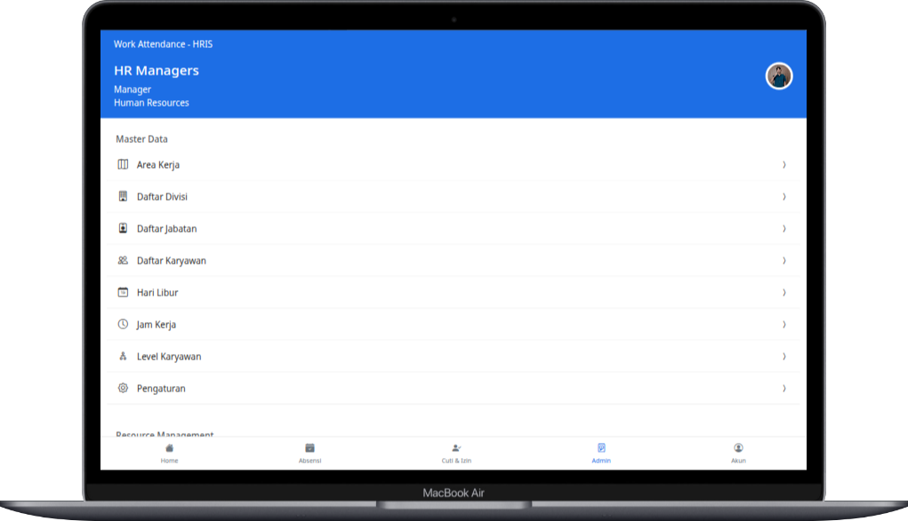
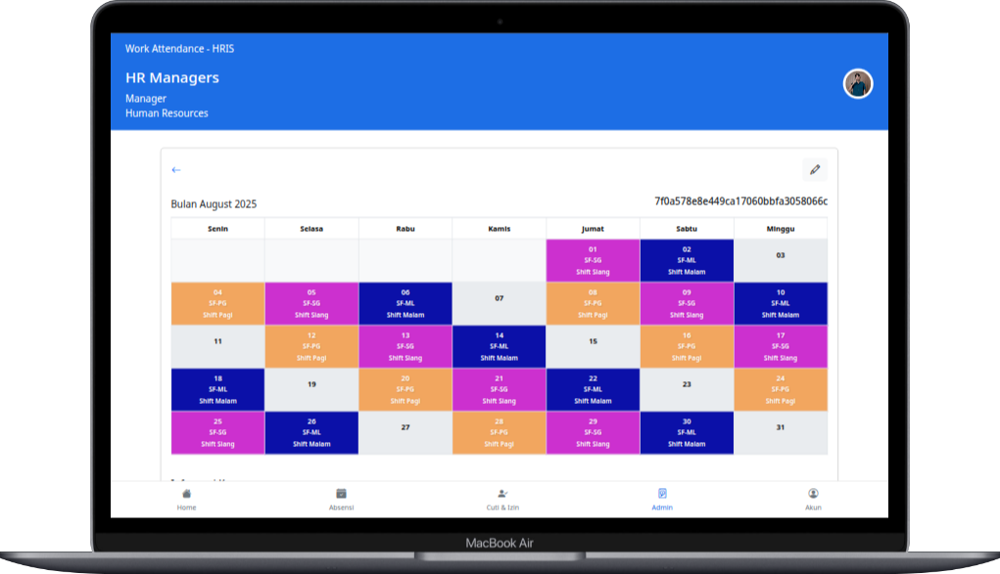
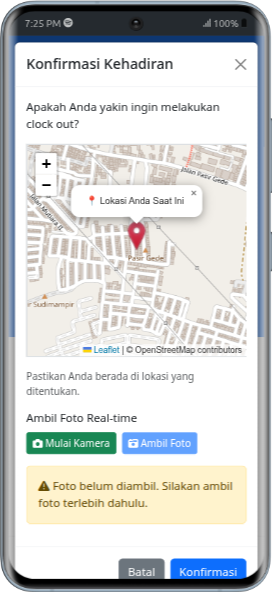
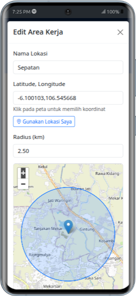
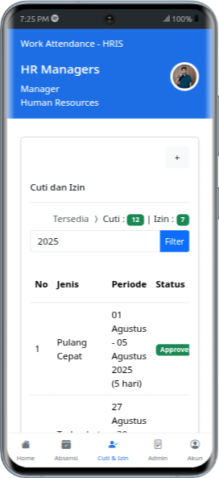
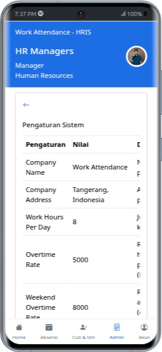
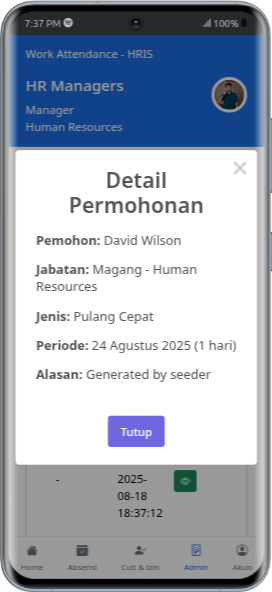

<h1>📌 Human Resource Management System</h1>

Sistem HRIS ini membantu mengelola data karyawan, absensi, cuti, dan payroll.

<h2>🚀 Instalasi</h2>
<ol>
    <li>Clone repository: <code>git clone https://github.com/rachmatsumo/attendance-system.git hris</code></li>
    <li>Buka directory: <code>cd hris</code></li>
    <li>Salin file <code>.env.example</code> menjadi <code>.env</code></li>
    <li>Set konfigurasi environment di file <code>.env</code></li>
    <li>Generate app key: <code>php artisan key:generate</code></li>
    <li>Jalankan: <code>composer install</code></li>
    <li>Jalankan: <code>npm install</code></li>
    <li>Jalankan: <code>npm run build</code></li>
    <li>Jalankan migrasi database: <code>php artisan migrate</code></li>
    <li>Isi data awal: <code>php artisan db:seed</code></li>
    <li>Jalankan server: <code>php artisan serve</code></li>
</ol>

<h2>🔑 Informasi Login</h2>
<ul>
    <li><strong>Admin</strong> 
        Email: <code>admin@hris.com</code> 
        Password: <code>password123</code>
    </li>
    <li><strong>User</strong> 
        Email: <code>david.brown@hris.com</code> 
        Password: <code>password123</code>
    </li>
</ul>

<h2>📄 Lisensi</h2>

Proyek ini dilisensikan di bawah <a href="LICENSE">MIT License</a>.

